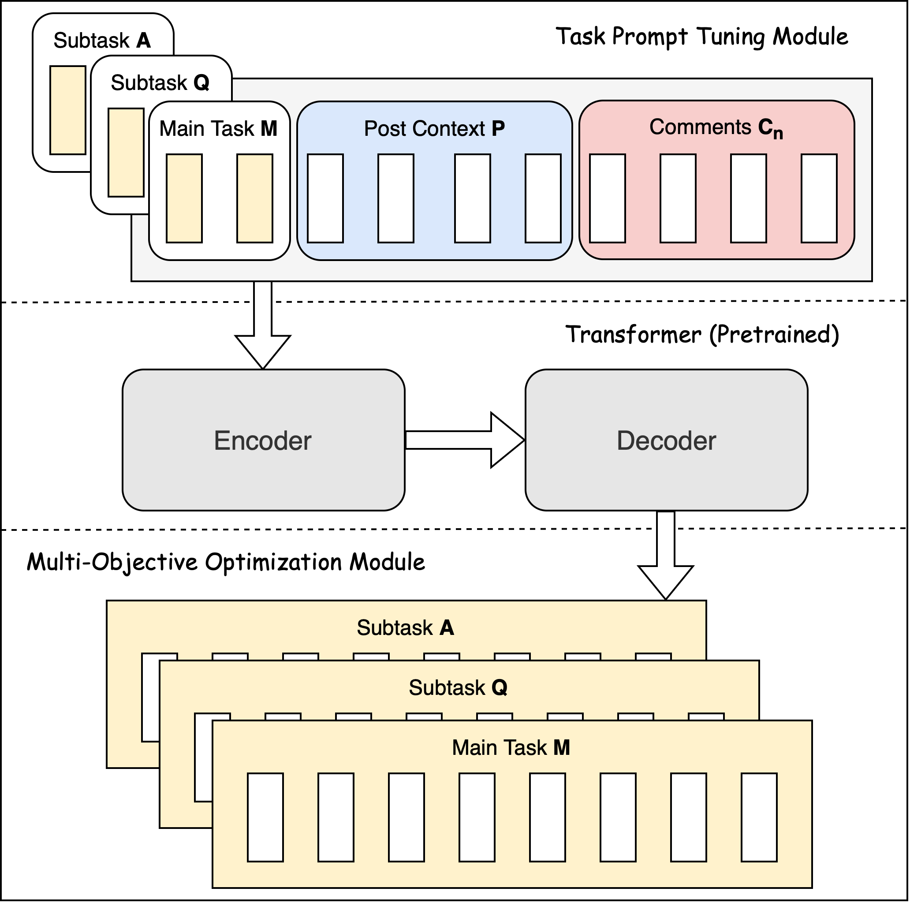
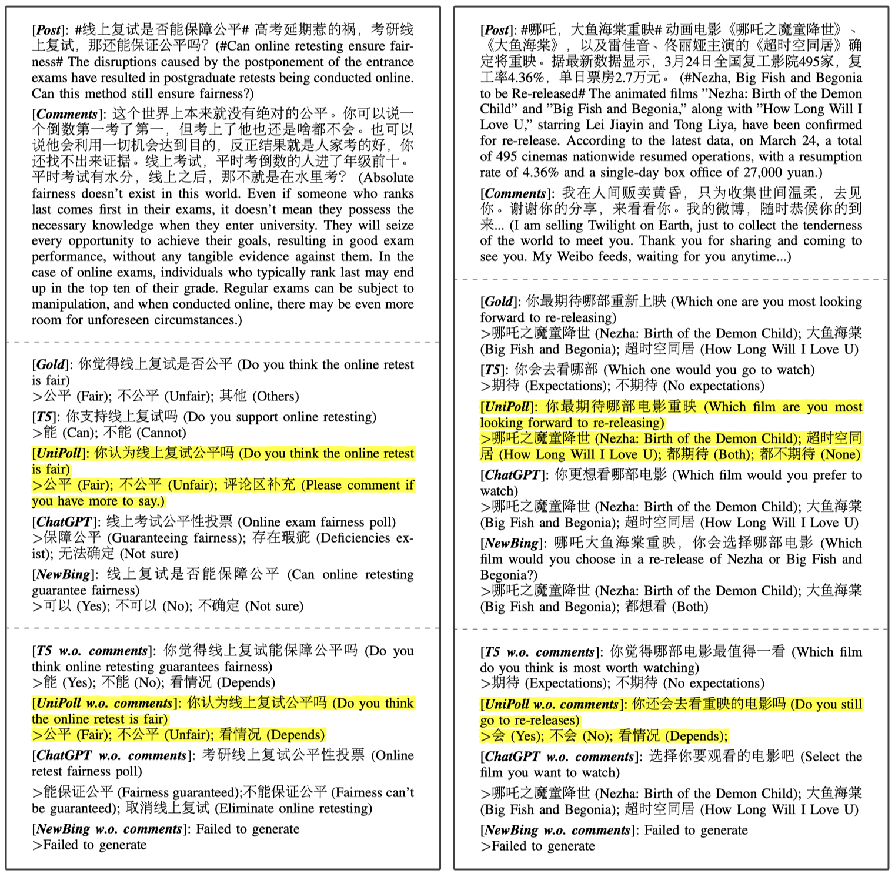

# UniPoll: : A Unified Social Media Poll Generation Framework via Multi-Objective Optimization

<div style='display:flex; gap: 0.25rem; '><a href='https://uni-poll.github.io'></a><a href='https://huggingface.co/spaces/X1A/UniPoll'></a><a href='https://github.com/X1AOX1A/UniPoll'></a><a href='https://arxiv.org/abs/2306.06851'></a></div>

The official implementation of the paper [UniPoll: A Unified Social Media Poll Generation Framework via Multi-Objective Optimization](https://arxiv.org/abs/2306.06851). 

This repository aims to automate the generation of polls from social media posts using advanced natural language generation (NLG) techniques. The goal is to ensure that even passive browsing users have their perspectives considered in text analytics methods.

<div style="text-align:center">
  
</div>


Key Features:

- Automatic generation of polls from social media posts.
- Leveraging cutting-edge NLG techniques to handle noisy social media data.
- Enriching post context with comments to capture implicit context-question-answer relations.
- UniPoll framework: A novel unified poll generation approach using prompt tuning and multi-objective optimization.
- Outperforms existing NLG models like T5 by generating interconnected questions and answers.


## Prepare the Environment

Please run the following commands to prepare the environment:

```bash
conda env create -f UniPoll.yaml
conda activate UniPoll
pip install git+https://github.com/tagucci/pythonrouge.git
```

## WeiboPolls Dataset

The original data can be downloaded from [this repo](https://github.com/polyusmart/Poll-Question-Generation/tree/main/data/Weibo), you can also find them in [data/WeiboPolls/origin](./data/WeiboPolls/origin).

## Prepare the T5 checkpoint

Download the Chinese T5 checkpoint from [here](https://huggingface.co/imxly/t5-pegasus/tree/main) and put them under the `checkpoints/imxly/t5-pegasus` folder.

## Experiments

### Training

To reproduce the results in the paper, please run the following commands:

```bash
python finetuner.py configs/path_to_config_file.json
```

- You can find the config files in the [configs](./configs/) folder, where configs are splitted according to different experiments. There is a detailed description of the correspondence between model names and configurations in the [configs/README.md](./configs/README.md) file.

- The processed data and results will be saved in the `outputs/run_name` folder.

- Please ref to [config.py](./config.py) for more details about the configuration.

### Inference

```
python inference.py
```

## Reproduce the Main Results

If you want to reproduce the main results in the paper, please run the following commands:

```bash
export CUDA_VISIBLE_DEVICES=0
python finetuner.py configs/main_ablations/UniPoll.json
```

- After the training is finished, you can find the results in the `outputs/UniPoll-t5` folder. 

### Results, Outputs and Checkpoint

- Here we provide the **model outputs, results and checkpoint** after executing the above commands. You can download them from [here](https://drive.google.com/drive/folders/1hTO5N3NfMNi5AoEPxGhH3KNQ8olWuwUV?usp=sharing).

## Results

This main results of poll generation are shown in the table below:

| Model | ROUGE-1 | ROUGE-L | BLEU-1 | BLEU-3 | 
| :---: | :---: | :---: | :---: | :---: |
| **UniPoll** | **47.92** | **45.02** | **39.96** | **22.78** |
| T5 | 45.33 | 42.69 | 37.34 | 21.06 |
| DUAL DEC | 34.98 | 32.84 | 29.41 | 8.84 |
| TOPIC | 33.60 | 31.59 | 28.55 | 8.46 |
| COPY | 32.58 | 30.61 | 25.82 | 5.58 |
| BASE | 23.15 | 21.62 | 20.87 | 2.67 |

## Demo

```shell
pip install gradio
python app.py --model_path "./outputs/UniPoll-t5/best_model" --device "cpu" 
```

## Case Study

<div style="text-align:center">
  
</div>

## Citation

```
@misc{li2023unipoll,
      title={UniPoll: A Unified Social Media Poll Generation Framework via Multi-Objective Optimization}, 
      author={Yixia Li and Rong Xiang and Yanlin Song and Jing Li},
      year={2023},
      eprint={2306.06851},
      archivePrefix={arXiv},
      primaryClass={cs.CL}
}
```

## Contact Information

If you have any questions or inquiries related to this research project, please feel free to contact:

- Yixia Li: liyixia@me.com
